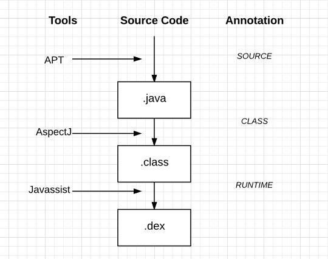

#Android下AOP介绍与实践

## 什么是AOP
面向切面编程（AOP是Aspect Oriented Program的首字母缩写） ，我们知道，面向对象（OOP）的特点是继承、多态和封装。而封装就要求将功能分散到不同的对象中去，这在软件设计中往往称为职责分配。实际上也就是说，让不同的类设计不同的方法。这样代码就分散到一个个的类中去了。这样做的好处是降低了代码的复杂程度，使类可重用。

但是人们也发现，在分散代码的同时，也增加了代码的重复性。什么意思呢？比如说，我们在两个类中，可能都需要在每个方法中做日志。按面向对象的设计方法，我们就必须在两个类的方法中都加入日志的内容。也许他们是完全相同的，但就是因为面向对象的设计让类与类之间无法联系，而不能将这些重复的代码统一起来。

也许有人会说，那好办啊，我们可以将这段代码写在一个独立的类独立的方法里，然后再在这两个类中调用。但是，这样一来，这两个类跟我们上面提到的独立的类就有耦合了，它的改变会影响这两个类。那么，有没有什么办法，能让我们在需要的时候，随意地加入代码呢？<mark>这种在运行时，动态地将代码切入到类的指定方法、指定位置上的编程思想就是面向切面的编程。</mark> 

一般而言，我们管切入到指定类指定方法的代码片段称为切面，而切入到哪些类、哪些方法则叫切入点。有了AOP，我们就可以把几个类共有的代码，抽取到一个切片中，等到需要时再切入对象中去，从而改变其原有的行为。
这样看来，AOP其实只是OOP的补充而已。OOP从横向上区分出一个个的类来，而AOP则从纵向上向对象中加入特定的代码。有了AOP，OOP变得立体了。如果加上时间维度，AOP使OOP由原来的二维变为三维了，由平面变成立体了。从技术上来说，AOP基本上是通过代理机制实现的。 

AOP在编程历史上可以说是里程碑式的，对OOP编程是一种十分有益的补充。

以上解释取自[JavaWeb过滤器.监听器.拦截器](http://hejiajunsh.iteye.com/blog/1776569)一文。

## 应用场景
* 业务埋点
* 性能日志
* 权限检查：业务权限（如登陆，或用户等级）、系统权限（如拍照定位)

## Android AOP

android下可以进行aop的工具
APT（annotationProcessor）， AspectJ， Javassist。

* APT在编译时生成 .java 文件；    
* AspectJ在.java编译为.class的时候，进行代码注入；    
* Javassist对已经编译好的class文件进行操作。

操作时机图

### APT

代表框架 ButterKnife 、 DataBinding、 EventBus3、Dagger2 等。

什么是APT?

APT(Annotation Processing Tool)是一种处理注释的工具,它对源代码文件进行检测找出其中的Annotation，根据注解自动生成代码。 Annotation处理器在处理Annotation时可以根据源文件中的Annotation生成额外的源文件和其它的文件(文件具体内容由Annotation处理器的编写者决定),APT还会编译生成的源文件和原来的源文件，将它们一起生成class文件。

[具体可以阅读此文](http://zkread.com/article/1290487.html)

[AnnotationProcessor可以参考此文](http://www.cnblogs.com/avenwu/p/4173899.html)

需要注意的是，Android Gradle 插件 2.2 版本之后自带了annotationProcessor来代替APT。APT的作者也提供了APT切换到annotationProcessor的方法[APT官网](https://bitbucket.org/hvisser/android-apt/wiki/Migration)

参考EventBus3.0 源码 了解apt的使用方法

EventBus3.0中最大的升级之一是@Subscribe注解采用编译时注解框架实现代码插入。
对应代码插入实现在EventBusAnnotationProcessor模块中。

在接入EventBus的模块中，可以自由选择是否通过注解生成订阅者方法索引列表，从而实现索引加速。

在引用订阅者索引加速后，编译时会将所有订阅方法存储在一个list中，生成文件位于"module/build/genereated/source/apt/..."目录下。

在EventBus接收到发送的事件后，会取出所有订阅该事件的方法。若开启索引加速后，则会直接从list中取出对应方法，否则通过反射查找对应方法，极大的影响性能。所以在EventBus3.0时应该开启索引加速。

### AspectJ
代表框架 [Hugo](https://github.com/JakeWharton/hugo)

Hugo原理以及文章介绍

* [Hugo探究](https://yq.aliyun.com/articles/7104)

* [Hugo 应用内方法调用监控实践](http://www.jianshu.com/p/e3d9221f8e37)

AspectJ 是一个基于 Java 语言的 AOP 框架，提供了强大的 AOP 功能，其他很多 AOP 框架都借鉴或采纳其中的一些思想。

AspectJ 是 Java 语言的一个 AOP 实现，其主要包括两个部分：第一个部分定义了如何表达、定义 AOP 编程中的语法规范，通过这套语言规范，我们可以方便地用 AOP 来解决 Java 语言中存在的交叉关注点问题；另一个部分是工具部分，包括编译器、调试工具等。

AspectJ 是最早、功能比较强大的 AOP 实现之一，对整套 AOP 机制都有较好的实现，很多其他语言的 AOP 实现，也借鉴或采纳了 AspectJ 中很多设计。在 Java 领域，AspectJ 中的很多语法结构基本上已成为 AOP 领域的标准。

在Android上接入AspectJ，因为沪江公司对AspetJ进行了一些Android方面的适配，所以接入很简单，[具体参考此文](http://www.jianshu.com/p/5c9f1e8894ec)， [GitHub地址](https://github.com/HujiangTechnology/gradle_plugin_android_aspectjx/blob/master/README-zh.md)。

同样的，我们参考一份源码，[动态权限管理框架](https://github.com/firefly1126/android_permission_aspectjx)

### Javassist

代表框架：热修复框架HotFix 、Savior（InstantRun）等

Javassist作用是在编译器间修改class文件，可以让我们直接修改编译后的class二进制代码。gradle提供了transform api，可以让我们在class变为dex之前做任何想做的事情。

Javassist使用过程[参考此文](http://blog.csdn.net/u010386612/article/details/51131642)

再撸一份源码，[基于Instant Run思想的HotFix方案实现](https://halfstackdeveloper.github.io/2016/09/23/%E5%9F%BA%E4%BA%8EInstant-Run%E6%80%9D%E6%83%B3%E7%9A%84HotFix%E6%96%B9%E6%A1%88%E5%AE%9E%E7%8E%B0/), [Github](https://github.com/HalfStackDeveloper/Savior)

## 应用到我们的项目
* 修改rxbus不使用反射
* 6.0及以上版本动态权限
* hugo接入

## 结语
关于AOP的相关文章

* [安卓AOP三剑客:APT,AspectJ,Javassist](http://www.jianshu.com/p/dca3e2c8608a)

* [Android AOP 实践笔记](https://juejin.im/post/5916706ca0bb9f005fddf3c9)
* [用了AOP的思想框架EasyMVP](https://github.com/6thsolution/EasyMVP/blob/master/README-zh.md)

