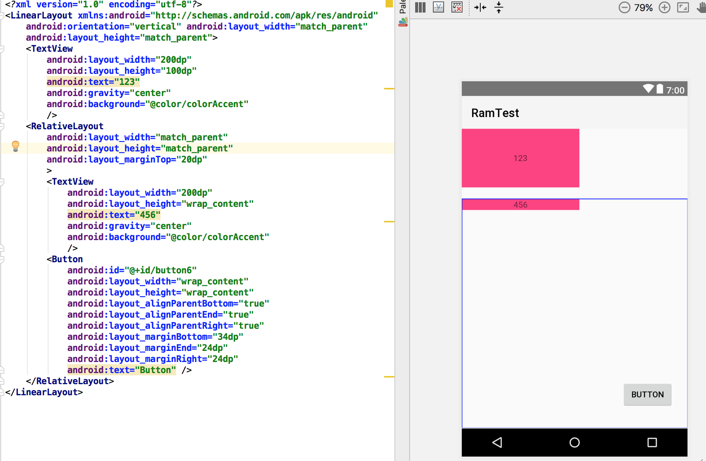
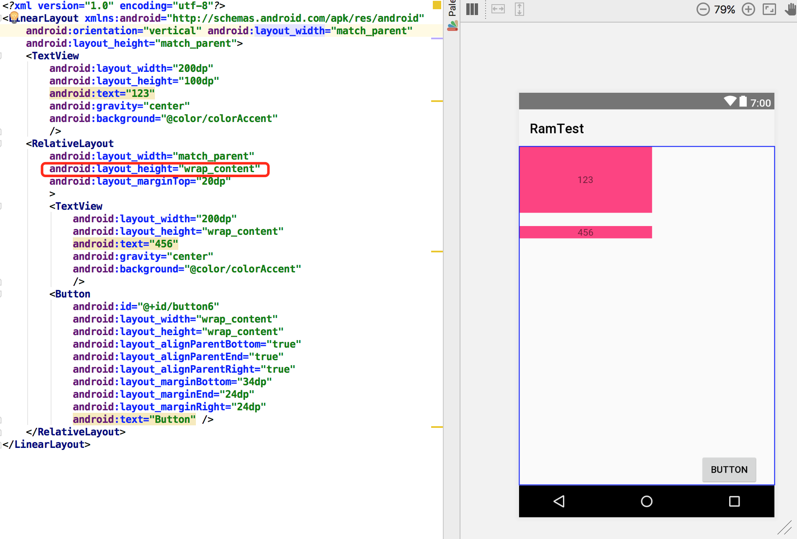
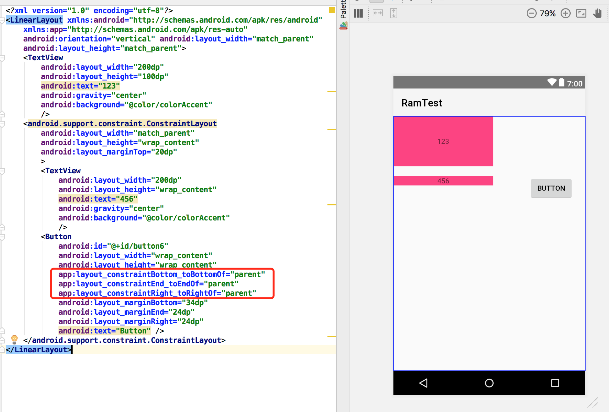

#现在能用ConstraintLayout 做些什么？

##ConstraintLayout，约束布局
A ConstraintLayout is a ViewGroup which allows you to position and size widgets in a flexible way.

ConstraintLayout是Android Studio 2.2中主要的新增功能之一，也是Google在2016年的I/O大会上重点宣传的一个功能。在Android Studio 2.3开始，IDE默认生成的Activity布局都是以ConstraintLayout做为根布局。

ConstraintLayout提供了可视化的方式来编写界面，但是在实际使用中，因为我们的布局复杂，很难用可视化操作去精准布局，所以我们还是倾向于手动去写xml。

##ConstraintLayout的优点
###1.对比RelativeLayout
实际开发中，我们最常用的layout是RelativeLayout，ConstraintLayout某种意义上可以认为是RelativeLayout的升级版。 举一个简单的例子

上图中一个button在RelativeLayout的右下方，当我们希望这个RelativeLayout的高度自适应的时候，我们去设置RelativeLayout的layout heiht为wrap content，我们会看到如下图结果，显然不是我们需要的。

但是如果用ConstraintLayout，可以轻松实现这个需求

###2.扁平化
我们都知道，我们在实现界面布局的时候，强调尽量少的嵌套，因为嵌套多会导致需要更多的时间去绘制view。为了减少嵌套，我们经常会使用RelativeLayout代替LinearLayout，但是RelativeLayout会对子View做两次measure。

相关view的绘制流程以及RelativeLayout和LinearLayout的性能对比，贴一个文章[Android中RelativeLayout和LinearLayout性能分析](http://www.jianshu.com/p/8a7d059da746)

我们看一个例子可以清晰看到ConstraintLayout减少嵌套

另外关于ConstraintLayout的性能分析，可以参考Google的文章[解析ConstraintLayout的性能优势](https://mp.weixin.qq.com/s?__biz=MzAwODY4OTk2Mg==&mid=2652044589&idx=1&sn=36f09ada2b279b0c56fcd91085ebe93a&chksm=808d5d68b7fad47e4de2704b24e51fd57799d19f1f7b334aaa9bfa2671c34ca8cc6bcd493882&mpshare=1&scene=1&srcid=092931KcG1jCBiP9gPdcz0JU#rd)

###3.应对需求多变性
还是刚才那个例子，如果ui需求修改成如下图

##使用ConstraintLayout
* 关于可视化操作，可以参考[动态图解&实例 ConstraintLayout Chain](http://blog.csdn.net/zxt0601/article/details/72736802)和[Android新特性介绍，ConstraintLayout完全解析](http://blog.csdn.net/guolin_blog/article/details/53122387)

* 手动写xml，可以参考[ConstraintLayout 属性详解 和Chain的使用](http://blog.csdn.net/zxt0601/article/details/72683379)和[ConstraintLayout 完全解析 快来优化你的布局吧](http://blog.csdn.net/lmj623565791/article/details/78011599)以及译文[ConstraintLayout (这到底是什么)](https://github.com/xitu/gold-miner/blob/master/TODO/constraint-layout-hell.md)

几个要点

* Chains
* Guidelines
* ConstraintSet

##关于坑
ConstraintLayout嵌套会出现显示不全的问题

其他暂时还未碰到

